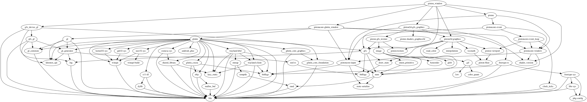

# piston_window [](https://travis-ci.org/PistonDevelopers/piston_window) [](https://crates.io/crates/piston_window) [](https://github.com/PistonDevelopers/piston_window/blob/master/LICENSE)
The official Piston convenience window wrapper for the Piston game engine

**Notice! If this is your first time visiting Piston, [start here](https://github.com/PistonDevelopers/piston).**

Piston-Window is designed for only one purpose: Convenience.

[Documentation](http://docs.piston.rs/piston_window/piston_window/)

* Reexports everything you need to write 2D interactive applications
* `.draw_2d` for drawing 2D, and `.draw_3d` for drawing 3D
* Uses Gfx to work with 3D libraries in the Piston ecosystem

```Rust
extern crate piston_window;
use piston_window::*;
fn main() {
    let mut window: PistonWindow = WindowSettings::new("Hello Piston!", (640, 480))
        .exit_on_esc(true)
        .build()
        .unwrap_or_else(|e| { panic!("Failed to build PistonWindow: {}", e) });
    while let Some(e) = window.next() {
        window.draw_2d(&e, |_c, g| {
            clear([0.5, 1.0, 0.5, 1.0], g);
        });
    }
}
```

`PistonWindow` uses Glutin as window back-end by default,
but you can change to another back-end, for example SDL2 or GLFW by changing the type parameter:

```Rust
let mut window: PistonWindow<Sdl2Window> = WindowSettings::new("Hello Piston!", [640, 480])
    .exit_on_esc(true).build().unwrap();
```

`PistonWindow` implements `AdvancedWindow`, `Window` and `EventLoop`.
Nested game loops are supported, so you can have one inside another.

```Rust
while let Some(e) = window.next() {
    if let Some(button) = e.press_args() {
        // Intro.
        while let Some(e) = window.next() {
            ...
        }
    }
}
```

Ideas or feedback? Open up an issue [here](https://github.com/pistondevelopers/piston_window/issues).

### Dependency graph


